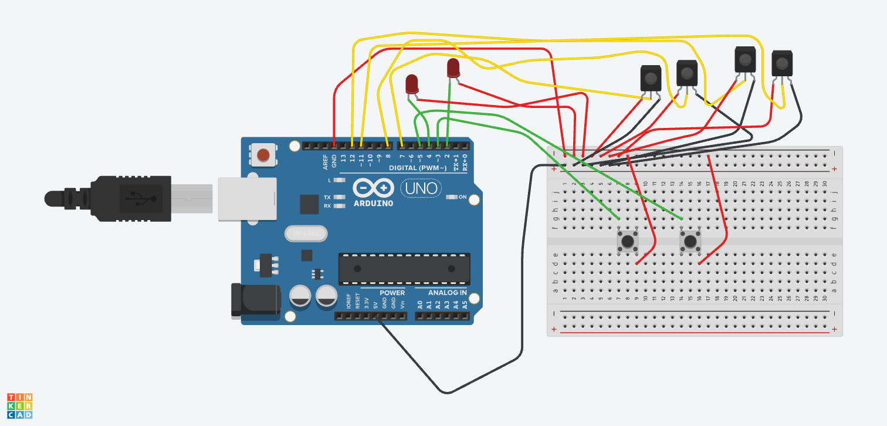

# Laser-QKD-BB84

This repository houses the code used for the physical QKD BB84 apparatus (as mentioned in [**Laser_QKD**](Supplementary_Information/Laser_QKD.pdf)). The code consists of Arduino Uno code for laser control and measurement as well as the Control Center code for the webpage and Python backend. Further instructions and descriptions will be discussed below.

## Code Compatability

The code in this repository was developed with consideration of using an Arduino Uno. The Arduino code considers the wiring as shown below.



In the wiring above, the red LEDs represent the 2 KY-008 laser modules and the IR receivers represent the 4 laser reciever sensor modules. The two buttons on the breadboard are optional and can be used for calibrating the apparatus.

For the control center webpage, Python and Node.js are required.

## Setup

Once the basic wiring setup (as shown in the wiring diagram above) is complete, upload the [`QKD_Control2.ino`](QKD_Code/QKD_Control2.ino) onto the Arduino Uno. Do this **after** calibration is complete (discussed in the next section). On the Arduino software, take note of the port. The port will be listed as `/dev/cu.usbmodemXXXX` where the `XXXX` are numbers. Thsi port can be found when selecting the Arduino Uno device near the top left of the Arduino application or at the bottom right after selection. Edit the `PORT` variable in the [`main.py`](QKD_Code/qkd-frontend/main.py) under the `Serial Setup` comment. An important note is to keep the Arduino Uno plugged into the **same** USB port on the computer or else the `PORT` address will change and the prior steps need to be repeated.

During protocol operation, the Arduino Uno must stay plugged into the computer. Before anything, first install [Node.js](https://nodejs.org). After the code is uploaded onto the Arduino, open Terminal or Command Prompt in the directory where `requirements.txt` is located. In the repo, it's in `QKD_Code > qkd-frontend > requirements.txt`. Then, do the following command in the current directory

``` bash
# It will be helpful to keep the venv name 'qkd_venv'
python -m venv qkd_venv
```

For Windows Command Prompt,

```bash
qkd_venv\Scripts\activate.bat
```

For Mac/Linux,

```bash
source qkd_venv/bin/activate
```

Next do,

```bash
# Install Python libraries
pip install -r requirements.txt

# Install required dependencies for React+Vite. Requires Node.js
npm install
```

Now that the environment is setup, run `run.py` using

```bash
python run.py
```

This should automatically run both the Python backend and React+Vite frontend in two different terminal windows. If there are no errors, look for the window that says `VITE` and `Local`. Copy the localhost address and paste it into the browser. This is the control center webpage. Now, run the protocol as desired.

## Calibration

To calibrate the optical setup described in the [**Laser_QKD**](Supplementary_Information/Laser_QKD.pdf)) paper, upload [`QKD_Control.ino`](QKD_Code/QKD_Control.ino) to the Arduino instead of [`QKD_Control2.ino`](QKD_Code/QKD_Control2.ino). This code utilizes the two buttons wired earlier in the wiring diagram. Each button activates one of the two phases of the protocol. The serial output can be read out with a small Python script.

```py
import serial
import tkinter as tk
from threading import Thread
import json
prev_data = ""
ser = serial.Serial('/dev/cu.usbmodemXXXX', 9600) # 9600 is the Serial baud rate. Make sure this matches the Arduino baud rate.
ser.reset_input_buffer()  # flush any unread junk
while True:
    line = ser.readline().decode().strip()
    try:
        data = json.loads(line)
        # print(data["Name"], data["Bit"])
        print(data.get("Name"), data.get("Bit"))
        print(data)
    except json.JSONDecodeError:
        print("Invalid JSON:", line)
```

Use this to see if the detectors are properly measuring results in each phase. 

## Control Center Webpage Guide

The webpage allows users to activate a phase in the QKD BB84 protocol. The top panel includes three subpanels detailing information on **Alice**, **Eve**, and **Bob**. At the start, only **Alice** should have a single number (just under her name). If anyone else has numbers right at the start, please hit **Restart** below. The number under **Alice's** name is the first bit she wants to send to **Bob**. At the bottom of her panel, it will indicate how many bits **Alice** will send in total. This number can be changed at the bottom in the **Bit Input** panel. The bits are limited to 1. Hit `Enter` or `Return` to finalize the change while in the input box. 

Underneath **Alice's** bits, the basis for the current bit is listed. This will be the encoding basis for the current bit. Similarly, the measurement bases for the current bit are listed in **Eve's** and **Bob's** panels. Set the physical apparatus accordingly. Complete the phases until there are no more bits left to transmit. After transmission is complete, the `Analysis` button will be available to see the channel security. 

### Contact

For further information or assistance, please reach me at [pratham.gujar30@gmail.com](mailto:pratham.gujar30@gmail.com). 